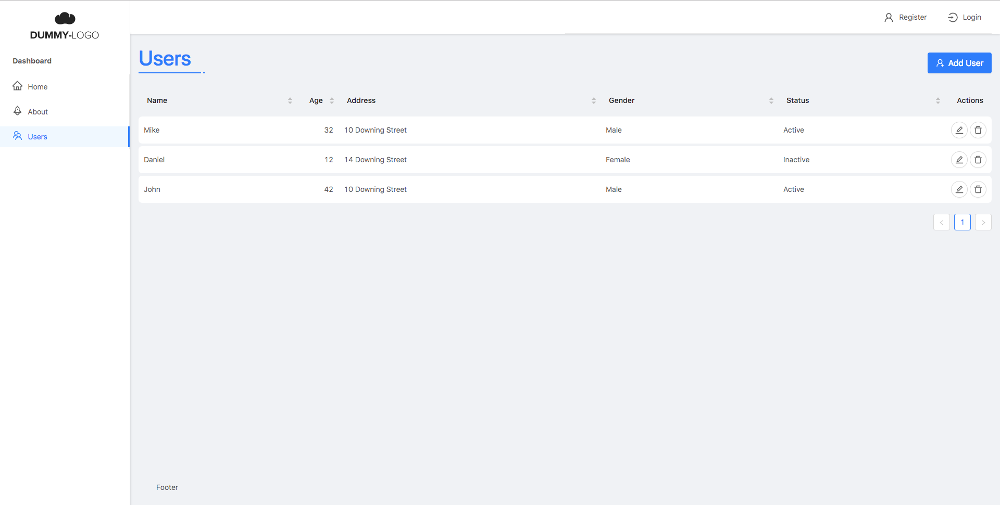

### React Starter Kit Dashboard.



#### It uses the following modules:
1. [React](https://reactjs.org) ([Create React App](https://github.com/facebook/create-react-app))
2. [Redux](https://redux.js.org) ([Redux Thunk](https://github.com/gaearon/redux-thunk))
3. [React Router v4](https://reacttraining.com/react-router/)
4. [Ant Design](https://ant.design)
5. [Less](http://lesscss.org) for Ant Design customization
6. [Axios](https://github.com/axios/axios)

#### Install dependencies:

```
yarn
```
or
```
npm install
```

#### Start project:

```
yarn start
```
or
```
npm start
```

#### Structure folders
```
my-app
├── public
│   └──  index.html
└── src
    └── services
       └── instance.js
    └── config
       └── cruds
            └── user.js
       └── locale.js
       └── menus.js
       └── routes.js
    └── components
       └── Auth
       └── Crud
       └── Layout
       └── Shared
    └── img
       └── logo.png
    └── pages
       └── 404.js
       └── Layout.js
       └── ...
    └── state(Redux)
       └── store.js
       └── reducers.js
    └── styles(Less)
       └── index.less
    └── utils
    └── index.js
```

#### Add news routes

Adding routes, modify src/config/routes.js file:

```javascript
import Home from './pages/Home';

export default [
  // path, component, exact
  createRoute('/', Home, true),
];
```

Code Splitting:

```javascript
const AsyncAbout = lazy(() => import('../pages/About.js'));

export default [
  // path, component, exact(default false)
  createRoute('/about', AsyncAbout),
];
```

#### Customization Ant Design

For custom Ant Design styles, modify src/styles/index.less, the Less variables that you can modify [here.](https://github.com/ant-design/ant-design/blob/master/components/style/themes/default.less)

#### API Configuration

Do not import **axios** directly but import the instance of axios from **api/instance.js**.

For Url API config add Key **REACT_APP_API** to .env files.

```
REACT_APP_API=http://localhost/my-api
```

## License

MIT
