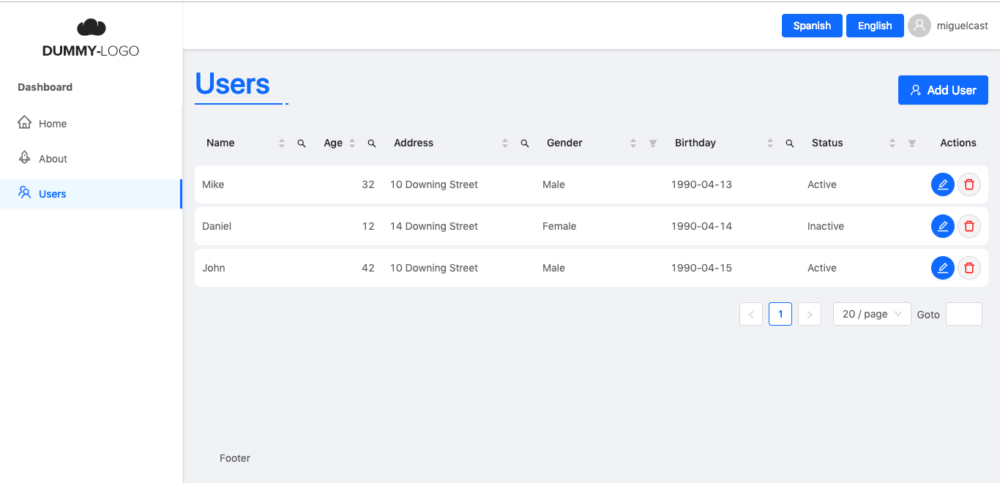

<h1 align="center">⚛ React Starter Kit Dashboard ⚛ </h1>



#### Features:
* Internationalization loading files from backend with i18next
* Easy to add new routes
* Easy to add new menus
* Create a CRUD very easy
* Forms such as Sign in, Sign up and Recovery password, connected with the store

#### It uses the following modules:
* [React](https://reactjs.org) ([Create React App](https://github.com/facebook/create-react-app))
* [Rematch](https://rematch.gitbooks.io/rematch/content/#getting-started)
* [React Router v5](https://reacttraining.com/react-router/)
* [Ant Design](https://ant.design)
* [Less](http://lesscss.org) for Ant Design customization
* [Axios](https://github.com/axios/axios)
* [React easy CRUD](https://github.com/cognox-sas/react-easy-crud.git)

#### Clone project

```
git clone https://github.com/miguelcast/cra-init-dashboard.git
```

#### Install dependencies:

```
yarn
```
or
```
npm install
```

#### Start project:

```
yarn start
```
or
```
npm start
```

#### Structure folders
```
src
|-- components
|   |-- Crud
|   |   |-- Form.js
|   |   |-- index.js
|   |   |-- List.js
|   |   |-- typeForms.js
|   |   |-- DateTableFilter.js
|   |   |-- SearchTableFilter.js
|   |   `-- hooks.js
|   |-- Auth
|   |   |-- index.js
|   |   |-- hooks.js
|   |   |-- Register.js
|   |   `-- Login.js
|   |-- Shared
|   |   |-- Title.js
|   |   |-- index.js
|   |   `-- ChangeLanguage.js
|   `-- Layout
|       |-- Logo.js
|       |-- index.js
|       |-- hooks.js
|       |-- MenuHeader.js
|       |-- MenuPrimary.js
|       |-- Header.js
|       `-- HeaderUser.js
|-- img
|   `-- logo.png
|-- registerServiceWorker.js
|-- utils
|   `-- general.js
|-- models
|   |-- home.js
|   |-- index.js
|   `-- auth.js
|-- config
|   |-- services.js
|   |-- routes.js
|   |-- constants.js
|   |-- menus.js
|   |-- store.js
|   |-- cruds
|   |   `-- user.js
|   `-- localization
|       |-- antdLocale.js
|       `-- i18n.js
|-- index.js
|-- services
|   |-- auth.js
|   `-- instance.js
|-- styles
|   |-- auth.less
|   |-- title.less
|   |-- index.less
|   |-- table.less
|   `-- layout.less
`-- pages
    |-- Form.js
    |-- Register.js
    |-- Login.js
    |-- List.js
    |-- 404.js
    |-- Layout.js
    |-- About.js
    |-- Home.js
    `-- ForgotPassword.js
```

#### Add news routes

Adding routes, modify src/config/routes.js file:

```javascript
import { LOGGED, GUEST } from './constants';
import Home from './pages/Home';
import Login from './pages/login';
import List from './pages/List';

export default [
  createRoute('/', Home, null, true),
  createRoute('/login', Login, GUEST),
  createRoute('/list', List, LOGGED),
];
```
This example shows you how config you routes using the function createRoute, this function receives a string as the first
parameter with the URL route, the second parameter is a React Component, the third parameter must be a string with a value
of "logged" to show that component when the user is logged in or "guest" when the user is not logged in or null when
both apply, the fourth parameter is a boolean type, which is the same as
"[exact](https://github.com/ReactTraining/react-router/blob/master/packages/react-router/docs/api/Route.md)" in React Router.

Code Splitting:

```javascript
const AsyncAbout = lazy(() => import('../pages/About.js'));

export default [
  createRoute('/about', AsyncAbout),
];
```

#### Menu configuration

Adding menus, modify src/config/menus.js file:

```javascript
const menus = {
  primary: [
    createMenu(
      '/', // (string) URL to navigate (previously configured in the routes )
      'Home', // (string) Title
      'home', // (string) Icon name from https://feathericons.com/
      GUEST // (string "logged" or "guest") The same as explained in the paragraph above
    ),
  ],
  header: [
    createMenu('/register', 'Register', 'user', GUEST),
    createComponent(
      () => HeaderUser, // (function () return ReactElement) Render this component in the menu
      LOGGED // The same as createMenu
    ),
  ],
};
```

#### Customization Ant Design

For custom Ant Design styles, modify src/styles/index.less, the Less variables that you can modify [here.](https://github.com/ant-design/ant-design/blob/master/components/style/themes/default.less)

#### API Configuration

Do not import **axios** directly but import the instance of axios from **api/instance.js**.

For Url API config add Key **REACT_APP_API** to .env files.

```
REACT_APP_API=http://localhost/my-api
```

## License

MIT
